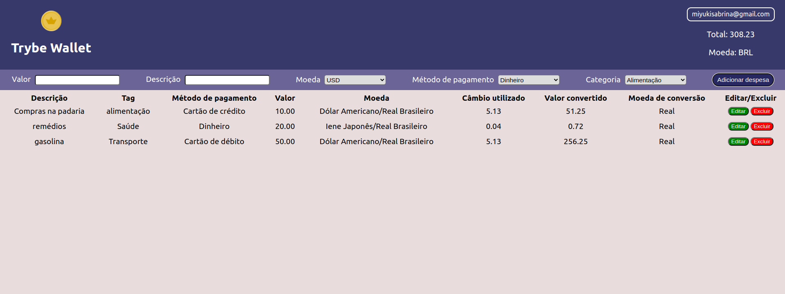

## **Bem-vindo ao repositório do projeto Trybe Wallet!**

### Screenshots

### Contexto
No projeto Trybe Wallet foi desenvolvido uma aplicação totalmente intuitiva de gerenciamento de despesas com conversor de moeda que pode ser definido pelo usuário. É possível visualizar uma tabela de gastos, e além disso podendo remover e editar essas despesas.

### Tecnologias utilizadas
Projeto desenvolvido utilizando React, Redux como gerenciador de estados globais da aplicação, CSS3 e React Testing Library. A aplicação web ainda consome os dados da <a href="https://economia.awesomeapi.com.br/json/all">API</a> do awesomeapi API de Cotações para realizar a busca de câmbio de moedas.

### Como utilizar a aplicação
- Dê um git clone no repositório do projeto;
- Entre na pasta da aplicação, instale as dependências com npm install e inicie a página com npm start;
- Na página de Login digite um e-mail válido. Ex: nome@domínio.com;
- Digite ainda uma senha com no mínimo 6 dígitos da sua preferência;
- Ou acesse o link do deploy <a href="https://trybe-wallet-lovat.vercel.app/">Aqui</a>

##### Observações:
###### Este projeto foi requisitado pela Trybe ao longo da formação do curso de Desenvolvimento Web, para avaliação do conhecimento adquirido nos módulos de Fundamentos. Todos os aquivos dentro da pasta src foram desenvolvidas por mim e os outros arquivos foram desenvolvidas pela Trybe.
